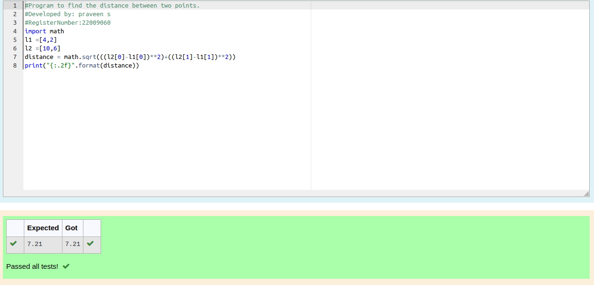

# DISTANCE-BETWEEN-TWO-POINTS

## AIM:

To write a python program to find the distance two 2 points

## ALGORITHM:

### Step 1:
Import the math module to use the built-in function for calculation  
### Step 2: 
Enter the coordinates of points one and two in the input 
### Step 3: 
Substitute the values in the distance formula 

### Step 4: 
Print the distance using the formula 
### Step 5: 
End the program

### PROGRAM:
```
#Program to find the distance between two points.
#Developed by: praveen s
#RegisterNumber:22009060
import math 
l1 =[4,2]
l2 =[10,6]
distance = math.sqrt(((l2[0]-l1[0])**2)+((l2[1]-l1[1])**2))
print("{:.2f}".format(distance))
```
  
### OUTPUT:


### RESULT:

Thus the program for calculating the distance between two points are successfully executed.
